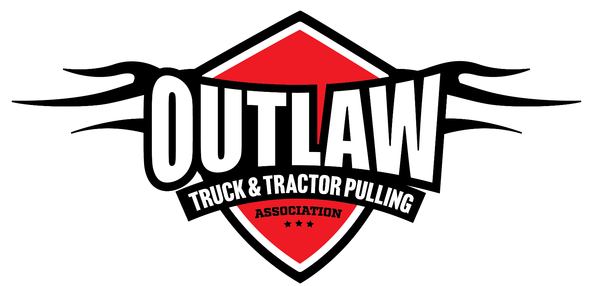

# OTTPA Rule Book

**2026 Official Rule Book** · V. 2026.03 – 06/25/26

Welcome to the online OTTPA rule book. This is the same rule book the association has always published as a PDF — now searchable and organized by section, and it's kept current here year-round instead of waiting on the next print run.

Use the search bar above, or browse by section:

- **[General Rules](rules/08-section-1---official-ottpa-divisions-classes.md)** — divisions, points, payouts, hook fees, and safety rules that apply to every class.
- **[Trucks](rules/19-section-12---truck-general-rules.md)** — general truck rules plus every truck class.
- **[Tractors](rules/28-section-21---tractor-general-rules.md)** — general tractor rules plus every tractor class.
- **[Downloads](downloads.md)** — PDF copies of the current and prior-year rule books.

Rules are updated once a year, after the November rules banquet. This site always shows the current year's rules.
