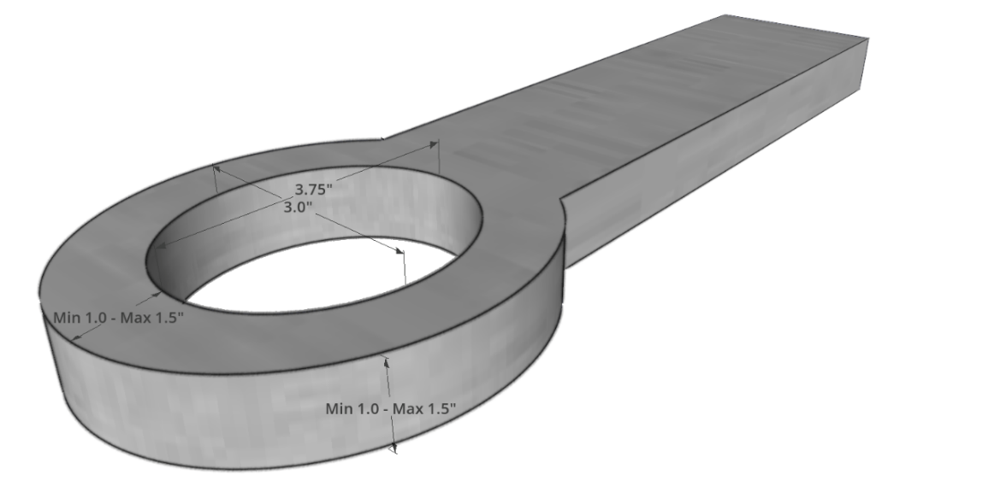

# Section 10 - GENERAL RULES
## 10.1 General: Insurance Waiver & Arm Bands
1.  **All pullers and OTTPA employees must sign the insurance waiver and get an arm band, or they will not get a check!**

## 10.2 - General: Rule Enforcement
1.  All the rules will be enforced by the Head Tech Official that is on-site. The Head Tech Official will strictly enforce all rules set up by the OTTPA and has the authority to disqualify any contestant if they are not meeting OTTPA rules prior to hooking to the sled.

2.  In the event of disputes, infractions, clarification, all decisions rendered by tech officials will be final.

## 10.3 - General: Competition Eligibility
1.  Contestants must be 18 years old or at least 16 years old with a parent or guardian consent.

2.  Contestants must be a member of OTTPA or pay 1-time hook fee.

3.  When registering the vehicle for the year, you are registering the chassis. That is your chassis for the year and points stay with the registered vehicle as long as the owner is the same. (Any major repairs or chassis changes need to be approved by the OTTPA Executive Board.)

4.  Clutch papers for a competition vehicle must be filed with the secretary and must be produced upon demand.

5.  All vehicles must pass a safety inspection.

6.  It is permissible for a licensed or single-entry competitor to enter or drive multiple vehicles in the same class. This includes competitors who compete with a license or a per hook entry.

## 10.4 - General: General Conduct
1.  Anything detrimental to the OTTPA association or board members will be grounds for disqualification.

2.  Any competitor or any of his crew incapacitated due to intoxicating agent, and/or drugs, his or her pulling vehicle will not compete for the duration of the pull. Obvious or excessive consumption of alcoholic beverages before or during pull will not be tolerated. Contestants shall not consume alcoholic beverages 6 hours prior to the start of that event.

3.  Use of profanity or threats by any puller or member of his pit crew toward any official, promoter or sponsor of a pull shall be a reason for suspension of said puller and vehicle for a period of one (1) year and ten (10) days from date of occurrence. In addition, loss of points and any end of season money and/or award.

4.  Misconduct will not be tolerated. Any reported issues of misconduct at an event the OTTPA Executive Board will determine the penalty.

5.  Pulling vehicles must always be operated in a safe manner within the confines of the track, pits and staging areas. Officials have the right to stop and disqualify any vehicle not being operated in a safe manner.

6.  STRONGLY recommend that everyone has an exhaust pipe for their generator that extends above their motorhome, hauler or toter-home so that exhaust fumes are directed above the vehicle.

## 10.5 - General: Annual Rules Meeting & Banquet
1.  The annual rules meeting will be held in November each year, all new rules will be enforced January 1st.

    1.  All proposed rule changes from classes are due to the OTTPA Executive Leadership team no later than October 1. It is recommended that these changes are provided to the leadership team by the class representative.

    2.  Details and discussion items will be organized by the OTTPA Executive Leadership team and distributed to the membership as soon as possible after they have all been received for all classes.

    3.  Details and discussions about proposals will be presented by the Class Representative to the full board at the annual banquet board meeting.

    4.  Class Representative will present rule changes for class member voting to the members present and take a class vote. Voting results will be returned to the OTTPA Board for review and final approval.

<!-- -->

1.  To have voting rights in a class you need:

    1.  To have competed in the class that season. (Ex. Competed in 2026 season to vote on rules for 2027)

    2.  To have a membership in that class.  
        > Example: LLM and MODS - adding motors or taking motors off need to have 2 memberships to vote in both classes.

## 10.6 - General: Event Scheduling
1.  All events/promotors must have class schedule set before May 1.

2.  After May 1 classes may be added to an event but cannot be a points hook.

3.  Rain dates must be on the schedule before May 1, or the new date will not be a points hook.

## 10.7 - General: Event Registration
1.  If you are not registered two (2) hours before the starting time of the pull, you will receive one warning and pay a \$50.00 extra hook fee for the day, in addition to the regular hook fee.

    1.  If you are late after the first warning, you will pay \$100.00 extra hook fee for the day, in addition to the regular hook fee.

2.  If you are in the pre-entry program, you need to go to the entry clerk and sign the insurance waiter upon arrival at the event. Notification of which person is driving the vehicle should be relayed to the Entry Clerk.

3.  You need to contact the Entry Clerk two (2) hours before the starting time if you are unable to attend.

4.  If you are not registered before your class starts you cannot pull that day.

5.  All pullers will have a number drawn to determine what position they will pull in.

6.  If you have pre-entered for an event you will be obligated to use the number that has been drawn for you.

## 10.8 - General: Video Review
1.  The only video that can be used for video review is video that is captured by the Outlaw livestream team.

2.  Video Review will only be used to overturn a call, it cannot be used to make a disqualification call.

3.  All disqualifications are subject to video review, with final approval made by head tech official or highest-ranking official at the event.

4.  The request for a video review needs to be done within 1 hour of the completion of the event where the disqualification occurred.

5.  Ruling needs clear and obvious evidence to overturn the officials spontaneous ruling.

6.  Tech official who made the original ruling on the track must watch the replay and be involved in the conversation. A sled operator may also be used as a reference.

## 10.9 - General: Disqualifications
1.  Violation of any rule shall constitute a disqualification.

## 10.10 - General: Protests
1.  All protests must be made before prize money is handed out.

    1.  The protest fee is \$50.00 for any rule except head and engine check, and ignition box.

    2.  If the protested vehicle is found to be illegal, all prize money for that pull and points for the year are lost and the protestor is returned his protest fee.

    3.  If the protested vehicle is found to be legal, he (the protested vehicle) keeps the protest fee and all prize money, if any is involved.

    4.  Protester must have pulled a vehicle in the class at least 6 times the previous pulling season.

2.  To protest engine size a \$2,000.00 protest fee is required for a pump and/or tear down of the engine.

    1.  Protests that require the removal of the head (check head legality-cubic inch protest) from the engine are \$2,000.00 in cash.

    2.  The protest must be done in writing and signed by the class member that is protesting.

    3.  If found legal, the person being protested will receive \$1400.00 and \$300.00 will go to OTTPA Tech.

3.  To protest an ignition box with an inspection of the box a \$1,000.00 protest fee is required for removal of box and shipping for inspection.

    1.  \$50 of protest fee will be used by OTTPA for shipping and processing the protested ignition box.

    2.  If found legal, the protested competitor will receive \$950.00.

4.  To protest an ignition box for a single event and force a competitor to use the OTTPA owned ignition box, a \$250 protest fee is required.

    1.  The \$250 protest fee will be given to the protested competitor.

5.  All protests will be handled by the Competition Director and the OTTPA Executive Board.

## 10.11 - General: Vehicle Inspections
1.  All vehicles will have a safety equipment inspection performed for the current season before the vehicle will be allowed to compete.

2.  Tech Officials have the authority to perform an inspection on a vehicle for rule compliance at any time.

3.  Tech Officials have the authority to check kill switches at any time at any event.

4.  Random class inspections for specific items can be performed at any time by a Tech Official.

    1.  The specific classes and the items that are being teched will be assigned by the Chief Executive Officer, Chief Operating Officer or President of the Board at random.

    2.  Should the inspections reveal illegal items on a vehicle, the facts of the inspection will be given to OTTPA Executive Board to decide penalties for such infractions.

## 10.12 - General: Support Vehicles
1.  Support vehicles (such as ATV’s, golf carts, Mules, Gators, Jeeps, etc.) are to be used as support vehicles only (for towing or carrying fuel, batteries, etc.). Misuse of support vehicles before, during and after the event will not be tolerated. If an OTTPA official asks you to park your vehicle, and you don’t comply, the pulling vehicle that the support vehicle is associated with will lose points for that night.

2.  All support vehicles must be parked 1 hour after the conclusion of each evening session at all events. One hour after the show ends, the OTTPA insurance coverage ends. Failure to comply with this rule is considered detrimental to the OTTPA as outlined in the General Conduct section of the General Rules listed above and will result in a 1 year and 10-day ban from pulling with the OTTPA.

3.  Proof of insurance for the support vehicle must be provided to the entry clerk and the clerk will provide a decal that is to be placed on the support vehicle.

## 10.13 - General: Traction Control
1.  Traction Control is defined as any on board computer device that senses an input of increased rpm or lost of traction in the drive train occurring during the run and sends an automatic output to counter this input. This electronic exchange will have occurred without operator input. Operator and manually controlled devices to control traction are allowed.

## 10.14 - General: Weights
1.  All weights must be securely attached to the vehicle. Loose ballast (sandbags, rocks, unattached metal, etc.) is not allowed.

2.  No more than 200 lbs. can be moved from the rear of the vehicle to the front of the vehicle without rechecking the drawbar.

3.  No liquid weight allowed.

## 10.15 - General: Fuel & Water
1.  Anyone found to be using nitromethane or nitrous oxide will be banned permanently from pulling with OTTPA.

2.  Any infraction related to fuel or water shall be a cause for suspension of said competitor and vehicle for the period of one (1) year and ten (10) days from the date of the occurrence. As well as the loss of points and any end of season money and/or award.

3.  All vehicles that require water injection must run VGM Water.

4.  VP Racing Fuel is the only fuel allowed to be used in all vehicles in all classes. VP DX Torque is legal to use in classes using diesel fuel.

5.  Absolutely no additives for diesel classes. (Exempted classes LSS & DSS).

6.  Alcohol and diesel vehicles can run VP Top Lube.

7.  A \$50 fine will be assessed for lack of fuel and water test ports for all classes.

8.  A \$50 fine will be assessed for any minor infractions of fuel or water quality.

9.  No computers allowed that automatically control any mechanical operation of the competing engine, clutch or vehicle except for water injection.

10. No electronic fuel injectors or metering devices will be allowed. Except Diesel 4x4 that have a factory computer.

## 10.16 - General: Automatic Transmission Use
1.  The use of torque converters, automatic shifts, etc. will be allowed during a pull in all Truck, Modified Tractor and Mini-Rod classes.

## 10.17 - General: Supercharger
1.  An 8-71 is a rotor length of 16 inches.

2.  A 14-71 is rotor length of 19 inches.

3.  High Helix is maximum 6.5 degrees of helix per inch of rotor length.

4.  

5.  The maximum outside diameter of the rotor including affixed strips is 5.840”, slide a gauge ring over rotor to measure.

## 10.18 - General: Drawbars and Hitches
1.  A Vehicle must have tow hitch on the front of the vehicle.

    1.  It cannot extend more than six (6) inches ahead of the farthermost front portion of the vehicle.

    2.  It will not be counted when measuring the length of the vehicle.

    3.  It must have a three (3) inch diameter hole, positioned horizontally.

    4.  It must be strong enough to push, pull or carry the vehicle at its heaviest weight.

    5.  It is to be used only for pushing, carrying or pulling the vehicle.

2.  All vehicles need to have a primary independent mounted hitch of significant strength to retain the vehicle.

    1.  The hitch itself is to be painted orange.

3.  Drawbar must be equipped with a steel hitching device not more than 1 1/2 inch by 1 1/2-inch square (1 ½ inch round stock); nor less than one (1) inch by one (1) inch square (1 1/8-inch round stock) and with an oblong hole of 3 inches wide by 3 3/4 inches long.

4.  Primary hitch must be secured to vehicle frame and rigid in all directions. No cables or chains allowed in hitch mounting. Any movement of hitch up or down will not be allowed.

5.  If a secondary hitch is installed on a vehicle, it must be covered. OTTPA assumes no liability if the secondary hitch is not covered, and the primary hook is placed in this hole and used for the competition pass. The pass will be measured where it is completed.

6.  Pulling point must be within 1 1/2 inches from back edge of hitch and no less than one (1) inches.

7.  **HITCH HOLE DIAMETER: 3 INCHES WIDE x 3.75 INCHES LONG  
    **

> 

| **Class**                         | **Max. Height** | **Center of Rear Axle to Hitch Point** |
|-----------------------------------|-----------------|----------------------------------------|
| Pro-Stock 4x4 Trucks              | 26 inches       | 36% of Wheelbase                       |
| Modified 4x4 Trucks               | 26 inches       | 30% of Wheelbase                       |
| 2.6 Diesel 4x4 Trucks             | 24 inches       | 44 inches minimum                      |
| 3.0 Diesel 4x4 Trucks             | 26 inches       | 44 inches minimum                      |
| Super Stock Diesel Trucks         | 26 inches       | 44 inches minimum                      |
| 2WD Trucks                        | 30 inches       | 18 inches minimum                      |
| All Tractors and Pro Stock Semi’s | 20 inches       | 18 inches minimum                      |
| Mini-Rod Tractors                 | 13 inches       | 6 inches minimum                       |
