# Section 11 - GENERAL SAFETY RULES
## 11.1 - General: Competitor Safety
1.  Any competition vehicle not equipped with a SFI roll cage and a required 5-point driver harness is required to have a securely installed lap belt with a quick-opening clasp. The OTTPA recommends that it be used at all times.

2.  All Modified, Modified Mini, and Tractor classes must utilize a SFI roll cage with a SFI 16.1 five-point harness properly installed.

3.  All contestants must wear fire suits that meet the following requirements:

    1.  Must be a minimum of SFI 3.2A1 driving suit.

    2.  Contestants must wear a 1 or 2-piece fire retardant suit.

    3.  Drivers who compete in flip top body styles must wear SFI 3.2A5 rated protective clothing.

    4.  Drivers in vehicles with cabs that do not have working doors must wear SFI 3.2A5 rated fire suits

4.  All contestants must wear a full-faced helmet

<!-- -->

1.  Full faced helmet must meet one of the following ratings:

    1.  SNELL SA2015 rating or newer.

    2.  SFI spec 41.2 rating

2.  No moto-cross helmets allowed.

3.  No modification or alteration of the helmet is allowed.

4.  While a vehicle is on the track all chin straps must be tightly fastened so that it would prevent the helmet from coming off a person’s head without unfastening the chin strap. If a competitor is seen on the track with the chin strap unfastened the competitor will be disqualified.

<!-- -->

1.  Head sock must be worn if the helmet does not have flame resistant lining and neck skirt.

    1.  Helmets with flame retardant linings and a flame-retardant neck skirt are allowed. If you use a helmet with both flame-retardant lining and a neck skirt, no head sock is required.

2.  Neck Collar / Neck Brace

    1.  All drivers in all divisions will be required to wear a full 360-degree neck collar or HANS device meeting SFI spec 3.3 or 38.1 with a SFI tag showing.

    2.  

3.  Fire Retardant Gloves are required

4.  Fire Retardant Shoes are required

## 11.2 - General: Fire Extinguisher
1.  A minimum of a two (2) pound ABC dry chemical fire extinguisher, with gauge, secured to the vehicle and convenient to the driver is mandatory.

## 11.3 - General: Engine Safety
1.  All throttles must be self-returning to the idle position when released.

2.  Foot throttles are required to have a toe strap.

3.  All injection or butterfly shafts on supercharged engines must have dual return-to-idle arms and springs.

4.  All discharge tubes must vent outside the frame rails in track of rear tires or into a container.

## 11.4 - General: Neutral Start Switch
1.  All vehicles shall be equipped with a neutral start switch, meaning the engine will start only when transmission is in neutral or park.

## 11.5 - General: Reverse Light
1.  A white reverse light is required at the rear of the vehicle facing backward and lit while the vehicle is in reverse.

2.  A light is required inside the operator’s area visible by the operator and lit while the vehicle is in reverse.

## 11.6 - General: Reverse Lockout
1.  All vehicles with automatic transmissions must have reverse lockout.

## 11.7 - General: Kill Switch / Air Shutoff
1.  Must be operated from the rear of the vehicle, mounted independent of the hitch, so that the sled can shut the vehicle down.

2.  All pulling vehicles must have an automatic ignition kill switch/or air shut off.

3.  All ignition engines must have a kill switch in working order within easy reach of the driver.

4.  Tech officials must be able to easily pull the kill switch from the rear of the vehicle.

5.  NO plastic trailer brake type switches allowed to be used for a kill switch.

6.  The breakaway kill switches will have attached to them a minimum of a two (2) inch diameter ring that is 1/8-inch-thick solid to be located approximately 2 to 4 feet above drawbar.

7.  There must also be a means of shutting the vehicle down within the driver’s reach.

8.  On trucks with electric injection fuel pumps, they must have an electric shut off or disconnect for the injection pump on the back of the truck.

## 11.8 - General: Fuel Shutoff
1.  All fuel injected ignition engines must have a fuel shut off valve control within easy reach of the driver.

## 11.9 - General: Firewall
1.  All competition vehicles (modified tractors are exempt) must have a complete firewall that is ½ inch thick with no holes except for controls. Holes for the controls cannot exceed an inch larger than the controls.

## 11.10 - General: Supercharger Safety
1.  A burst panel deflection shield (commercially available only) must be placed in front of any supercharger burst panel whenever a fuel system component(s) are located directly in the path of contents escaping the burst panel.

    1.  Fuel System components include but not limited to fuel lines, connection blocks, valves, fuel tank or vent.

    2.  Deflection shield must cover the entire area of the burst panel and be enclosed on both ends.

    3.  Contents from burst panel must be deflected upward or downward whichever direction has the clearest path away from fuel system components including but not limited to those listed.

    4.  Deflection shield cannot be fabricated, must be obtained from an aftermarket supplier and installed as intended by supplier, no modifications.

2.  All supercharger drive components must conform to SFI specifications.

3.  Restraints

    1.  Supercharger restraint system is mandatory and shall consist of four separate straps, one on each corner of the supercharger, with each strap securely fastened to the engine by means of its own attachment bracket.

    2.  The top attachment bracket is to be sandwiched between the lower surface of the injector body and the upper surface of the supercharger case.

    3.  The bottom attachment bracket for each strap shall be connected to the engine by a minimum of one (1) 5/16-inch bolt or stud (SAE Grade 5 or better).

    4.  All supercharged engines with blower drive facing the driver must use SFI Spec. 14.1 blower restraints.

4.  Mounting Studs

    1.  All superchargers must be mounted to the intake manifold by use of aluminum studs only. (No steel studs allowed.)

5.  

6.  All centrifugal superchargers must use a SFI 4.3 Blanket.

## 11.11 - General: Turbocharger Safety
1.  All turbochargers are required to have an OTTPA accepted blanket that completely encloses the compressor housing and securely fastened as intended by the manufacturer.

    1.  Blanket must contain a minimum 5 (five) layers of Kevlar

    2.  Blanket displaying a SFI 4.1 certification is accepted but not required.

    3.  Turbocharger compressor housing blankets are accepted from the following manufacturers.

        1.  Taylor Motorsports Products

        2.  Stroud Safety

        3.  Ram Jet

2.  1.  
    2.  
    3.  

3.  No titanium wheels in any turbo chargers are allowed in any class.

4.  All turbochargers not under a hood must be completely shrouded, except for inlet and exhaust pipes, with steel 0.060" or thicker.

5.  Turbochargers under fiberglass hoods must be completely shrouded with 0.060" metal under the area of the fiberglass, except for inlet and exhaust pipes.

6.  All turbos facing sideways (i.e. towards the crowd) are to have .060 metal in front of the turbo wheel to prevent the wheel from escaping.

7.  All turbocharged engine exhaust stacks need to remain intact while hooked to sled. If it falls off the vehicle it will result in a disqualification. Puller will still receive last place points.

8.  

9.  Turbo Exhaust Wheel Containment –

    1.  Any turbocharger used in OTTPA competition where exhaust exits to atmosphere must have an approved exhaust wheel containment device installed.

    2.  Containment device and any attaching components or hardware must be supplied by an OTTPA approved manufacturer.

    3.  Containment device cannot be placed in any part of exhaust pipe. If containment device is attached to turbo exhaust housing flange by use of a clamp, then the exhaust pipe must be welded to the containment device.

    4.  Any clamp used to attach a safety device to the turbocharger that is not supplied by the turbocharger manufacturer must be a Double V type clamp as shown in diagram. Clamp has a stainless steel band covering the entire circumference. Clamp must be manufactured by a USA supplier.

> 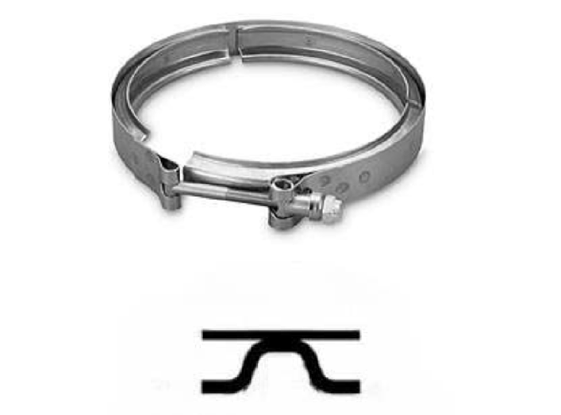

5.  Containment device must be installed as designed by manufacturer. No modifications or alterations of any kind allowed.

6.  Manufacturer may identify each component or assembly by engraving part numbers or some type of identification into each part.

> 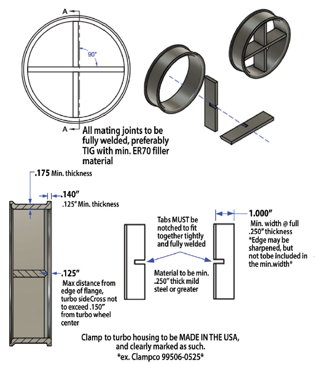

7.  OTTPA Approved Containment Devices

    1.  **Option 1:** **Cross Bolts in Turbo Exhaust Housing - installed by turbo manufacturer**

        1.  Qty. 2 (two) .500-inch diameter, grade 5 or greater bolts installed by drilling qty. 4 (four) holes into turbo exhaust housing and welded in place.

        2.  Bolts must be installed at 90 degrees from each other and no more than .0625-inch (1/16-inch) between the two bolts.

        3.  Cross bolts must be located as close to the center of exhaust wheel as possible.

    2.  **Option 2: Containment Adapter - supplied by turbo manufacturer**

        1.  Containment device supplied by turbo manufacturer must be approved by OTTPA Tech Services and installed as supplied by manufacturer.

        2.  Containment device must be located as close to exhaust wheel as possible.

        3.  Containment device and components supplied for attachment to turbo housing must contain the manufacturer’s name or logo identification.

    3.  **Option 3: Containment Adapter - supplied by** **OTTPA** **approved manufacturer**

        1.  Exhaust adapter must be fabricated using two interlocking pieces of .250-inch x 1.000-inch flat steel notched .250-inch x .500-inch at center creating a single interlocking assembly and fully welded into a cross pattern.

        2.  Round steel containment adapter must be a minimum .175-inch wall thickness and contain cross assembly fully welded inside the adapter, not in exhaust pipe.

        3.  Leading edge of cross assembly can be sharpened a maximum of .250-inch back from leading edge facing the exhaust wheel. Any tapered or sharpened edge is in addition to 1-inch minimum width.

        4.  Location of leading edge of cross assembly not to exceed .125-inch behind face of adapter flange on turbo side.

        5.  Adapter mounting flange must be a minimum .140-inch wide at base of flange and a minimum .125-inch wide at narrowest point of taper.

        6.  Adapter must be attached to turbo exhaust housing flange using clamp supplied by adapter manufacturer. Since this containment device is attached to turbo exhaust housing flange by use of a clamp, the exhaust pipe must be welded to the containment device. Adapter and attaching clamp must be clearly identified with manufacturer name or logo.

8.  Exhaust Wheel Cage  
    ***NOTE:*** Exhaust Wheel Cage is a containment device bolted to exhaust housing by turbo manufacturer

    1.  Billet steel cage made from 304 stainless bolted and fastened to exhaust housing as supplied by the turbo manufacturer.

    2.  Exhaust wheel cage must be fastened using bolts, a minimum qty. 8 (eight) - 5/16-inch diameter, grade 8 or greater bolts required or wheel cage fastened as designed by turbo manufacturer.

    3.  Turbo exhaust wheel cage must be manufactured by sane turbo manufacturer on which it is installed.

    4.  Exhaust wheel cage must be installed as supplied. No modifications allowed.

    5.  OTTPA Technical Services to determine any additional dimension or specifications required.

<!-- -->

10. All turbocharged vehicles with the air inlet on the turbocharger not in the engine compartment (under the hood, behind the side shields and behind the grill) must have a cross in front of the compressor wheel. Cover (3/8” star pattern of billet) will be V-banded between air shut off and compressor cover.

11. Turbocharger Intake Cross

    1.  Any single turbocharger application listed below requires a one-piece, 3/8-inch solid billet cross, located within 8 inches from front edge of compressor wheel inducer blade and behind the air shutoff gate.

        1.  Classes: Super-Farm, Light Limited Pro Stock, 3.0 Diesel Truck, 3.0 Diesel Truck, Limited Pro-Stock, 540 Light Pro-Stock

    2.  Intake cross must be mounted solidly to the turbo compressor housing using a Double V type clamp.

    3.  Intake cross must be installed as manufactured and supplied by the manufacturer.

    4.  Maximum intake cross diameters are listed by division as follows:

        1.  Super Farm: Max Cross Diameter – 7in.

        2.  Light Limited Pro Stock: Max Cross Diameter – 7in.

        3.  3.0 Diesel Truck: Max Cross Diameter – 7in.

        4.  3.6 Diesel Truck: Max Cross Diameter – 7 in.

        5.  Limited Pro-Stock: Max Cross Diameter – 8in.

        6.  540 Light Pro-Stock: Max Cross Diameter – 9in.

## 11.12 – General: Intercooler Mounting and Containment
1.  All remote mounted intercoolers (ie. intercoolers not directly mounted to the engine within the engine shielding and hood) must be securely fastened to the chassis or to a structure that is mounted directly to the chassis. Intercooler cannot be suspended by the air inlet or outlet pipes.

2.  Intercooler cannot be mounted behind the vehicle firewall or within the driver’s compartment.

3.  Intercooler housings made from a billet material only will be required beginning 2027 OTTPA season in Super Stock Diesel 4X4 Trucks, and Semi divisions. No welded housings will be accepted after end of 2026 season.

4.  All intercoolers not contained within the normal engine shielding and hood must be shielded the same as a turbocharger not under the hood. Must be shielded with steel at least 0.060-inch thick.

## 11.13 - General: Engine Cables
1.  All inline turbocharged engines are required to have a cable(s) placed between first and second cylinder through exhaust manifold port area. Must use one of the following two options:

    1.  Cable must be a minimum of one (1) 3/8” manufactured pendant line with a rating of at least 3000 lbs. or more with a tag from manufacture that indicates rated load capacity with swaged sockets. No alterations to cable or cable ends.

    2.  Two (2) 3/8” cables between first and second cylinder through exhaust manifold port area with a minimum of 4 clamps at the splice or crimps with a coupler on each cable. Cable(s) must circle the entire head/block assembly with a maximum of 4” slack.

## 11.14 - General: Engine Shielding
1.  Harmonic Balancer Shield

    1.  All automotive engines equipped with a non S.F.I. approved harmonic balancer shall be shrouded with ¼ x 1-inch steel no more than one (1) inch away in direction of rotation, 360 degrees, to be securely fastened with a minimum of two (2) ears that are ¼ inch thick and 1-inch-wide, each extending one (1) inch in front of the hub.

    2.  A bolt in the crankshaft to hold dampener pulley is required.

    3.  All balancers or steel hubs are required to have a retainer to restrict forward movement more than ½ inch to keep balancer from coming off the crank.

2.  Tractor - Damper Shield

    1.  All Tractor engines (Super Stock, Pro Stock and Super Farm, etc.) are required to shield all rotating mass mounted to front of crankshaft 360 degrees from front of engine block to one inch in front of the rotating mass.

    2.  Shield to be from frame rail to frame rail by a minimum of .125-inch steel or aluminum, and fastened to frame on each side by a minimum of two evenly-spaced bolts (3/8-inch Grade 5 minimum bolts).

    3.  The remainder of 360-degree shield will be standard side and hood shielding.

> ***Note:*** Shield may be notched to allow belt to pass through and beneath frame to drive fuel or oil pump.

3.  Semi - Damper Shield

    1.  Engines are required to shield all rotating mass mounted to front of crankshaft 360 degrees from front of engine block to one inch in front of the rotating mass.

    2.  Shield made from 1/8-inch steel must be constructed to cover outer circumference of damper and extend no more than 1-inch beyond front of damper.

    3.  Damper shield must be formed to within 1-inch of circumference.

    4.  Shield must extend rearward to closest point (ie. front engine mount, engine block, or oil pan) and have minimum 2-inch lip bent upward in front of damper.

    5.  Shield must be independently fastened to engine and/or chassis with minimum of four (4) - 3/8-inch grade 5 bolts. The remainder of 360-degree shield will be standard side and hood shielding.

4.  A deflection shield is required on both sides of all Y and V type engines.

    1.  Shield must extend the complete length of block casting and be securely fastened.

    2.  Shield to be made of aluminum or steel a minimum of .060 thickness or safety blanket material.

    3.  Shielding on all engines must extend from base of head or the uppermost point of piston travel to two (2) inches below bottom center of crankshaft throw and be securely fastened.

5.  Inner Side Shields - All inline engines are required to have an additional side shield consisting of:

    1.  .125 (1/8 inch) steel or titanium or .250 (1/4 inch) thick aluminum inside of the current .060-inch steel or aluminum side shields with a minimum of ½ inch air gap.

    2.  The shield is independent of the current side shield and must be attached to the chassis (frame) with a minimum of 5/16 fastener at both ends and at the center on the bottom. Or, suspended a minimum of 3 inches below the top of the frame rail and to the engine block at both ends bolted solid to the bolt if suspended or with a length of 5/16 chain if fastened at bottom at deck height on the top.

    3.  This shield must extend from the bottom of the head to the centerline of the crankshaft and extend the full length of the block on each side of the engine

<!-- -->

4.  Spark Plug Shielding

    1.  Any Hemi type engine valve cover that is not equipped with a hold down device (ie. snap ring or billet retainer) for the spark plug tube must install a retaining kit accepted by OTTPA Technical Services.  
        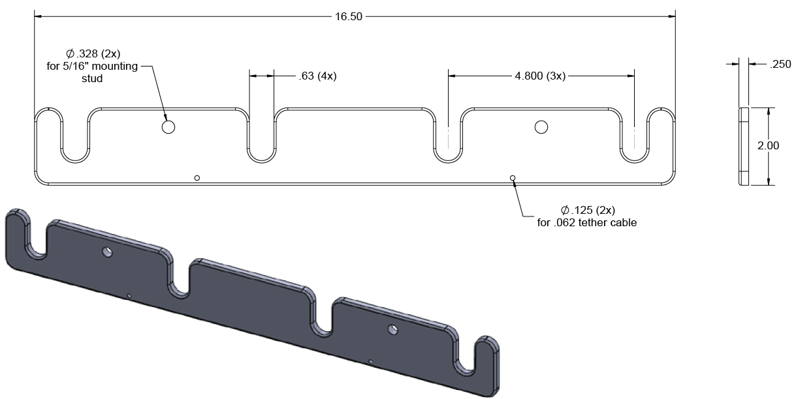

    2.  Any Hemi valve cover that uses only the spark plug and nut on top of valve cover to secure the spark plug tube requires this device.

    3.  K&I Newberry design has been approved for this purpose. Modern Machine and Tool is the manufacturer and supplier of kits accepted by OTTPA Technical Services.

    4.  Any Hemi type engine spark plug tube retainer that is SFI 14.4 rated is accepted.

## 11.15 - General: Clutch / Transmission
1.  All competition vehicles need to use a SFI certified steel flywheel. No cast flywheels are allowed.

2.  Clutch must be SFI 1.1 or SFI 1.2 approved.

3.  

4.  All V8 engines must utilize a “block saver” steel or aluminum plate between the engine and bellhousing.

5.  All manual transmission clutches are required to be surrounded by a SFI 6.2,SFI 6.3 or SFI 6.4 approved bellhousing with a current, non-expired, SFI sticker and cannot have cracks or had an explosion inside. The bellhousing must have a liner. If in a cast chassis tractor, a SFI 4.2 spec scatter blanket that covers the entire bellhousing area from the rear of the engine to the front of the transmission. No holes allowed in the bellhousing other than those put in by the manufacturer or used for clutch engagement purposes.

6.  All automatic transmissions and torque converters must be covered 360 degrees from the rear of the engine block to the front of the tail shaft with an SFI 4.1 spec blanket or shield. Blanket must be fastened to the engine block with two straps, one above and one below the crankshaft centerline. Blanket must have 6” of overlap on the bottom with straps that are 2” wide and no more than 1” apart. Blanket must be fastened to the engine block with two straps, one above and one below the crankshaft centerline. Blanket must have 6” of overlap on the bottom with straps that are 2” wide and no more than 1” apart.

7.  Lenco transmissions are required to have an approved explosion blanket.

8.  Blankets must be in good condition with SFI Date legible and not expired.

    1.  Certification Date must be within a 5-year date, or must be recertified by manufacture of blanket, or replaced. No exceptions will be allowed for this rule.

## 11.16 – General: Bellhousings
1.  Fabricated Bellhousing

    1.  Vehicle where an SFI bellhousing is not available to cover the flywheel and clutch assembly, an SFI type bellhousing may be fabricated using a minimum 1/4-inch steel and covered 360 degrees with an SFI 4.2 blanket.

    2.  Use of fabricated bellhousings limited to applications where a SFI 6.2, 6.3 or 6.4 bellhousing is not available or feasible for application (i.e. flywheel/clutch assembly larger than 14 inches).

2.  Bellhousing SFI Specs

    1.  Bellhousing must be originally purchased and initially installed as a SFI 6.2, 6.3 or 6.4 bellhousing with SFI certification sticker and manufacturer’s inspection sticker in place.

> ***Note:*** Once a bellhousing has contained a clutch explosion it must be replaced.

3.  Bellhousing Attachment  
    Modifieds, Modified Mini, FWD/TWD Trucks, and Component Tractors must use a SFI approved bellhousing.

    1.  Bellhousing must be mounted as SFI certified by manufacturer with grade 8 studs or bolts that can be identified as grade 8. Socket head bolts allowed only for clearance problems.

    2.  Bellhousing attachment must be by minimum grade 8 - 3/8-inch diameter bolts or studs and must pass through bellhousing flange and block plate. Fasteners installed into engine block or block adapter must be at a depth of 3/8-inch (.375-inch) in steel or 3/4-inch (.750-inch) in aluminum. All other bolts must sandwich bellhousing and block plate using a grade 8 nut and washer. All block plates and block adapters must be made from billet steel or aluminum.

    3.  All automotive type engines with SFI bellhousings and clutch must run a full block plate, either a unit commercially available, or fabricated from a minimum 3/16-inch steel or 1/4-inch aluminum.

    4.  Any SFI bellhousing manufactured with 4 (four) quadrant/anti-rotation bolt holes, either 1/2-inch or 3/4-inch diameter, located two above crankshaft centerline and two below crankshaft centerline, must install proper size minimum grade 5 bolt and must pass through both block plate or block adapter and bellhousing and be securely tightened using equal hardness nut and washer per bellhousing manufacturer SFI certification.  
        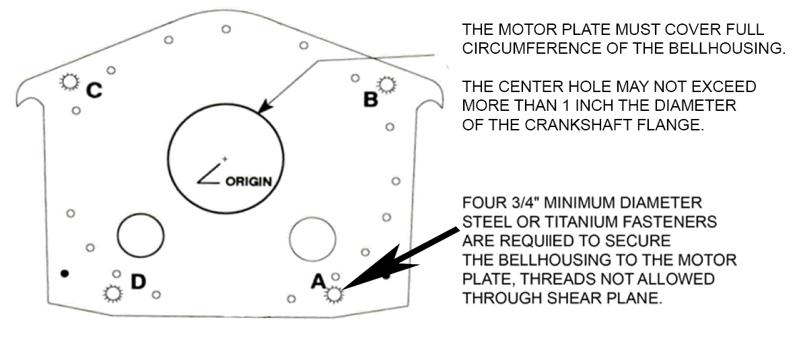

    5.  Bellhousing must be mounted with grade 8 studs or bolts per manufacturer’s bolt pattern for motor and bellhousing. All bolts must be in place.

    6.  All bellhousing liner(s) must be made from steel or titanium. Liner must be flush with bellhousing flange / mounting surface and fastened with qty. 1 – 1/4-inch aluminum bolt threaded into liner. No modification or rearward movement of liner away from flywheel to allow for larger flywheel or ring gear. Liner can be notched for starter pocket.

4.  Bellhousing Certification / Renewal

    1.  All SFI 6.2, 6.3, or 6.4 bellhousings must display a valid and current SFI certification decal affixed by the manufacturer that includes the expiration date before being allowed to compete in any OTTPA sanctioned event.

    2.  Effective May 01, 2027, OTTPA will only accept SFI 6.2, 6.3, or 6.4 bellhousings made of steel or titanium in all applications, divisions, and levels of OTTPA competition.

    3.  The NTPA or OTTPA stamp is not accepted as a replacement for a valid and current SFI certification decal.

    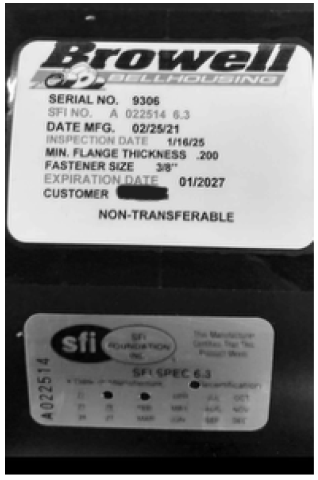

5.  Bellhousing Inspection Opening

    1.  The inspection / maintenance hole (i/m hole) in the bellhousing shall not extend farther forward at its top edge than flush with the cross-shaft hole, or farther downward at its bottom edge than to allow one 1/2-inch bolt diameter edge distance for the fastening holes in both the bellhousing and the “i/m hole” cover.

    2.  The length of the “i/m” hole shall not be more than 8 1/2 inches measured in a straight line and the ends of the hole shall be smoothly and fully radiused to produce an oval shape.  
        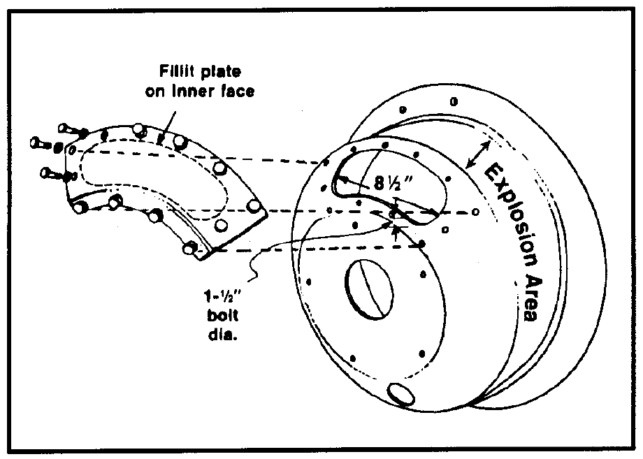 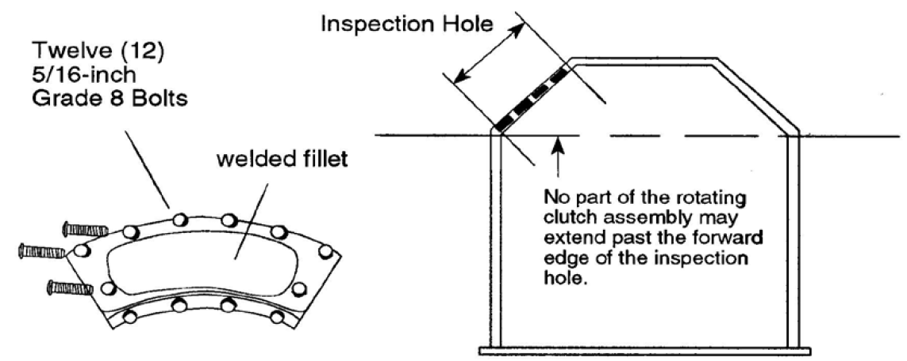

    3.  Inspection Cover:

        1.  There must be (12) 5/16-inch, Grade 8, or better cap screws securing cover to bellhousing.

        2.  The cover must have a plate or fillet that fits flush inside of bellhousing.

        3.  The cover and fillet must be steel.

        4.  The fillet must be welded to the cover and all bolts must be flush to the inside.

6.  Bellhousing Slot

    1.  SFI certified bellhousings with Crower-type clutch stand adjustment slot are acceptable.

## 11.17 - General: Brakes / Driveline Brakes
1.  All competing vehicles must be equipped with working rear wheel brakes, except four-wheel drive trucks, which must have working front wheel brakes.

2.  All driveline brakes must have 3/8-inch steel, 360 degrees around brake components, and both ends must be closed with 1/8-inch steel or greater.

## 11.18 - General: Driveline / Driveline Shielding
1.  Any vehicle running planetary rear-end must enclose entire driveline in a minimum of 1/4-inch steel or aluminum mounted to the frame with adequate bracing.

2.  All driveline shield components over 16 inches in length must be tethered on each end by two opposing restraints, Tethers must attach at 180 degrees of each other and a minimum of 3” and a maximum of 6” from each end of each driveline shield component.

3.  Driveline shield tether to be constructed of a minimum of 2” wide by 1/8” thick nylon or polyester strap. One end of the tether must attach to one side of the chassis then go around the driveline shield then attach to the other side of the chassis. Tether must be attached to chassis by a minimum of one 3/8” grade 5 bolt with a grommet on each side or wrap around the chassis and use a buckle to fasten it to itself.

4.  FWD drivelines that use driveshaft hoops must use the same tether configuration to be attached to the main or common hoop holder between chassis and hoop assembly.

5.  If a split shield design is used, mount as in Rule 5b in the Truck General: Driveline / Drive Shielding rules.

6.  No chain type couplers allowed for engine drive line connection.

## 11.19 - General: Front Axle Skid Plates
1.  Skid plates for the front axle are required.

2.  Specifications for front axle skid plates:

    1.  A skid plate must be mounted in line with each frame rail and extend from the center of the front axle forward (on both sides equal in strength to the frame rail material).

    2.  Skid plate surface to be a minimum of 4 inches wide and 12 inches long with a minimum of a 6-inch curve when measured from the front most part of the rolled edge.

    3.  Support must have a minimum ground clearance of 4 inches and a maximum of 6 inches.

    4.  Front axle support to be made of 2-inch x .095 chrome moly steel tubing or same material as tractor frame rails.

    5.  Front axle support should be connected to each frame rail in line and extend towards front of tractor.

    6.  Front axle skid support should have a radius to prevent digging into track.

    7.  Front axle support should be strong enough to support the front-end weight of tractor.

## 11.20 - General: Stabilizer Bars
1.  Stabilizer bars are required (no wheels are allowed).

2.  The drawbar and drawbar assembly will not in any way be attached to the stabilizer bar assembly.

3.  The stabilizer bar must extend a minimum of 32 inches behind a line drawn from the center of the wheel to the ground (Fig D).

4.  The pad at the bottom of the stabilizer bar must not be more than 10 inches off the ground at 32-inch point (Fig B)

5.  The stabilizer pad must be a minimum of 5 inches square, with a minimum of 20 inches allowed from the outside of one pad to the other (Fig A.)

| 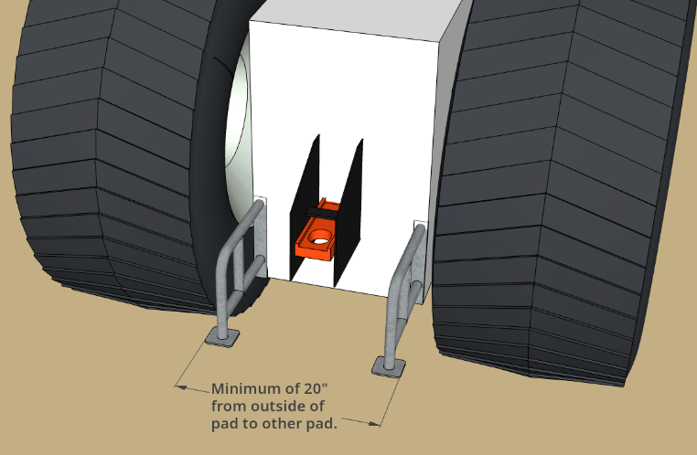 **Fig. A** | 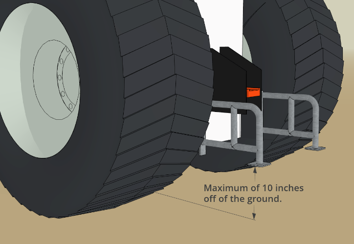 **Fig. B** |
|---|---|
| 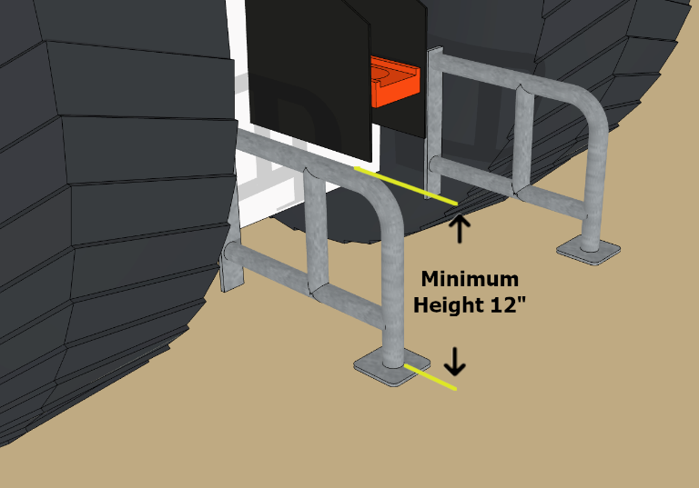 **Fig. C** | 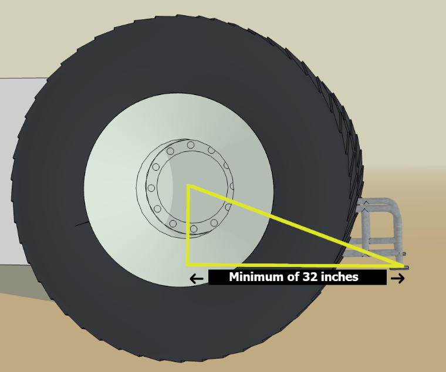 **Fig. D** |

6.  No crossbars between stabilizer bars allowed behind the point of hook.

7.  All tractors, in addition to stabilizer bars, must have a brace that extends vertically a minimum of 12" from the rear most tip of skid pads (Fig C).

    1.  There must be a support brace extending inward to frame, axle or top of stabilizer bar arms.

    2.  Material used must be of minimum strength of materials used for stabilizer bars. Design and materials must withstand a severe impact from the sled.

    3.  Vertical brace should extend rearward a minimum of 2" from radius of the rear tire.

8.  All Two Wheel Drive Trucks must have stabilizer bars (no wheels allowed).

    1.  Stabilizer bar length must be a minimum of 2" back from the furthermost point of the tire

    2.  5" square pad on the bottom

    3.  Maximum 6" high if within tire track or 10" high if not within tire track.
