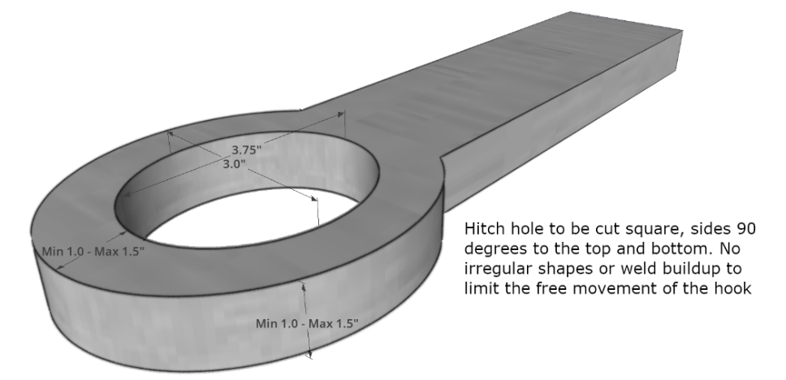

# Section 13 - PRO STOCK 4WD TRUCK (P4x4)
**Unless specifically outlined below in the class specific rules, the Truck General Rules and the overall General rules outlined above will apply.**

## 13.1 - General Rules
1.  Pro Stock 4WD trucks will compete at a maximum weight of 6,200 lbs.

## 13.2 - Drawbar / Hitch
1.  Any nonmember or puller that does not conform to rules shall lose 2 inches of hitch height. Or 200 pounds of weight by their choice.

2.  Hitch will be measured with NO ONE standing on the back of the pickup while measuring hitch. NO moving of weight after the scale.

3.  Body can not be in a raised position while measuring the hitch. It must me in a fully lowered ready to compete position.

4.  Primary hitch must be secure to vehicle frame in all directions.

5.  Hitch stem may be any length, as long as point of hook is not less than 36% of wheelbase.

6.  Hitch point to rear axles centerline must be a minimum of 36% of wheelbase. This distance cannot change during the pull.

7.  Hitch stem angle must not exceed 25 degrees measured on the stem w/angle finder. Main stem must be straight from point of hook to pivot point. (On the same plane).

8.  No part of hitch can be attached or come into contact with the rear axle during a pull except the stem adjuster.

9.  Hitch adjuster must not be located more than 6 inches from the point of hook.

10. Hitch height cannot exceed 26 inches from the point of hook to the ground or the track. This maximum cannot change during a pull.

11. No “L” shaped drawbars. No “Reese style” or telescoping hitches. Stem must be rigid 1 piece.

12. No drawbar angle greater than the angle of the sled chain. Acceptable angle is 0 degree to a maximum of 25 degrees. This will be measured by the angle of a straight edge from the point of hook to the center of the pivot point.

13. All turn buckles that control drawbar height from BELOW the drawbar must be vertical or angled FORWARD from the attachment point on the drawbar to axle housing. Attachment point on axle cannot be above centerline of axle housing.

14. All turn buckles that control drawbar height from ABOVE the drawbar must be vertical or angled BACKWARD from attachment point on drawbar to frame.

15. No cam type rear ends. All rear ends must be welded or bolted by a minimum of 3 bolts per side solid with a minimum of 3 5/8 grade 5 bolts per side to the frame

16. Drawbar to be made of steel, minimum of two (2) square inches’ total material at any point. This will include the area of the pin with the pin removed. Pins will be minimum of 7/8-inch diameter. Drawbar must be equipped with steel hitching device constructed of not more than 1 ½ inch square nor less 1-inch square (1 1/8-inch round stock) with an oblong shaped hole of 3 ¾ inch long by 3 inch wide.

## 13.3 - Body / Chassis
1.  All body components must have a factory production OEM frame.

2.  Vehicle must retain original wheelbase plus or minus ½ inch and stock appearance, 133” maximum.

3.  Hood scoops are optional.

## 13.4 - Engine
1.  Engine DOES NOT need to be the same make as vehicl~~e~~.

2.  Rear edge of block to center of the front axle can be no less than 14”.

3.  May only run cast iron blocks with any cast iron heads or aluminum type heads also acceptable are NHRA pro stock legal with wedge shaped combustion chambers, no hemi type chamber (can have spark plug in middle through valve cover), OEM or after market. Any internal engine modification allowed.

4.  Any single 4500 carb flange, 4-barrel manifold required naturally aspirated. Sheet metal intake manifolds are allowed.

5.  A 1% variance to the engine cubic inch limit of 485 cubic inches.

6.  Maximum engine bore spacing of 4.9 inches.

7.  No electronic timing devices.

8.  No traction control, no digital boxes.

9.  

## 13.5 - Tires, Wheels, Suspension
1.  Tires must be street legal. No tread alterations of any kind are allowed. Sharpening, cutting, re-grooving, or tread touch up is not allowed. No larger than 33 x 12.50 x 16 or 305 x 70 R16 only DOT approved with factory stamp. The size must be displayed on the tire.

2.  Maximum 12-inch wheel width.

3.  Tires can be sanded/trued up, but CANNOT alter tread design, pattern angle or shape.

4.  The outside edge of the tire on the narrow axle must overlap the centerline of the tire on the wide axle by at least one (1) inch.

5.  Solid rear suspension allowed.

6.  Any rear-end housing size is permitted. A maximum of one-ton front-end housing is allowed. The width of the housing is to be like the width of the factory housing.

7.  Front airbag suspension is allowed and cannot be controlled from inside the cab.

## 13.6 - Weights / Weight Boxes
1.  Weights/weight bar must not extend forward more than sixty (60) inches from the centerline of the front axle.

2.  Weight box must be pinned after scaling the vehicle and before measuring the hitch and can’t be changed until done pulling.

## 13.7 - Transmission
1.  Aftermarket transmission and transfer case is allowed.

## 13.8 - Fuel & Water
1.  Alcohol fuels and propylene oxide are not allowed.

2.  VP Racing Fuel is the only fuel that is allowed for use in all pulling vehicles.

3.  VGM water is mandatory for all water injected vehicles.

4.  \$50 fine will be assessed for lack of fuel and water test ports for all classes.

5.  \$50 fine for any minor infractions of fuel quality.

6.  Throughout the year the class will have a fuel check at a minimum of five (5) events.
