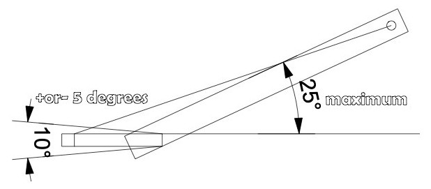

# Section 17 - MODIFIED 4WD TRUCKS (4WD)
**Unless specifically outlined below in the class specific rules, the Truck General Rules and the overall General rules outlined above will apply.**

## 17.1 - General Rules
1.  Vehicles in this class must be 4 Wheel Drive

2.  All pulling vehicles must have an automatic ignition kill switch/or air shut off. All ignition engines must have a kill switch in working order within easy reach of the driver.

3.  No electronic traction control devices such as MSD digital, Davis Electronics or power grid will be allowed.

4.  No electronic fuel injector or metering devices allowed such as timing retards or fuel lean out all must be triggered manually by the driver as the vehicle pulls.

5.  Wiring and components must be readily visible for inspection.

6.  MOD 4WD vehicles will compete at a maximum weight of 6,350 lbs.

## 17.2- Drawbars/Hitch
1.  When measuring the hitch, light pressure may be applied to a tire that is not touching the ground to have it make contact with the ground. This will allow for a more accurately measured hitch height.

2.  Hitch height cannot exceed 26 inches from the point of hook to the ground or the track. This maximum cannot change

3.  during pull.

4.  Primary hitch must be secure to vehicle frame in all directions, Hitch stem may be any length, as long as point of hook is not less than 30% of wheelbase.

5.  Hitch point to rear axles centerline must be a minimum of 30% of wheelbase. This distance cannot change during the pull.

> 

6.  Hitch stem angle must not exceed 25 degrees measured on the stem w/angle finder. Main stem must be straight from point of hook to pivot point. No part of hitch can be attached or come into contact w/ rear axle during pull except the Stem adjuster.

7.  Hitch adjuster must not locate more than 6 inches from point of hook.

8.  Hitch height cannot exceed 26 inches from the point of hook to ground or track.

9.  No “L” shaped drawbars.

10. No drawbar angle greater than the angle of the sled chain. Acceptable angle is 0 degree to a maximum of 25 degrees. This will be measured by the angle of a straight edge from the point of hook to the center of the pivot point.

11. 

12. 

13. Maximum hitch height shall be 26 inches. This maximum cannot change during pull.

14. Drawbar to be made of steel, minimum of two (2) square inches’ total material at any point. This will include the area of the pin with pin removed. Pins will be minimum of 7/8-inch diameter. Drawbar must be equipped with steel hitching device constructed of not more than 1 ½ inch square nor less 1-inch square (1 1/8-inch round stock) with an oblong shaped hole of 3 ¾ inch long by 3 inches wide.

15. No cam type rear ends. All rear ends must be welded or bolted by a minimum of 3 bolts per side solid with a minimum of 3 5/8 grade 5 bolts per side to the frame.

## 17.3 - Body / Chassis
1.  Vehicle must have hood, grille & fenders in place as intended by manufacturer.

2.  Vehicle body style must be, or have been, available from a dealer as a mass-produced body style. Fiberglass replicas will be allowed.

3.  Vehicle must maintain original appearance.

4.  Vehicle appearance:

    1.  No bare chassis or flat beds permitted.

    2.  Must have metal frame.

    3.  Non-metal floor allowed in bed.

    4.  Windshields are recommended but not required. If you don’t have a windshield, it is recommended that you have your face shield down on your helmet.

    5.  Fiberglass hood scoops, spoilers, fender flares are allowed.  
        ***NOTE:*** Contact the OTTPA Executive Board to request a variance for this rule.

    6.  No onboard compressors or controls that can change the suspension. Single fill point for all air suspensions.

## 17.4 - Frames
1.  May be different from the make and model of the truck body.

2.  Tubular steel frames are allowed.

## 17.5 - Engine
1.  The engine is any engine, or its replica, available in a passenger car. For a replica to be considered legal it must accept and swing a stock crankshaft.

2.  No diesel engines permitted.

3.  Engine may have a maximum bore spacing of five (5) inches.

4.  Automotive engines at all levels of competition are only allowed to run a maximum of two (2) valves per cylinder.

5.  Fuel injection (and carburetors) and header may protrude through the hood.

6.  Engines must be naturally aspirated only.

7.  No superchargers or turbo chargers allowed.

8.  Must have a 3-point engine mount and a support saddle for the rear of the transmission.

9.  Engine must be in stock location, which is defined as being within engine compartment as manufactured, behind stock grille and in front of stock firewall.

10. Vehicle may run without radiator, engine may be moved forward, but engine must stay behind the grille, except for high performance type starters and accessories with crankshaft.

11. Rear of engine block may not be moved forward of centerline of front axle

12. VP Racing Fuels only.

13. No pressurized fuel system. Q16 is allowed. No M3, M5, or oxygenated type gas allowed. No nitro-based fuel nitro or power enhanced alcohol will be allowed. Top lube allowed.

14. The vehicle must have vertical exiting exhaust; height of pipe must be a minimum of one (1) foot above the bend. ***NOTE:*** Vertical is defined as “being in plumb” with a ten (10) degree variance in any direction permitted.

15. Vehicles to conform to provision of Modified Tractor engine shielding.  
    ***NOTE:*** Entire engine to mean anything that is bolted to the engine block.

> ***NOTE:*** A bubble or hood scoop is optional. If used, the scoop or bubble must cover the carburetors or fuel injection if the induction system protrudes through the hood.

## 17.6 - Tires, Wheels
1.  Center of wheels cannot exceed plus or minus six (6) inches of fender wells for wheelbase being used, which means a vehicle may run up to a maximum of 133-inch wheelbase.

2.  Wheels must be in fender wells as described above. The body may be stretched in the middle to accompany this.

3.  The outside edge of the tire on the narrow axle must overlap the centerline of the tire on the wide axle by at least one (1) inch.

4.  Maximum tire size of 112-inch circumference which will be measured using a measuring device set on 112”. Measurement will be taken with the tire at the competing air pressure.

5.  All measurements on the rough are allowed + or – 1 inch until can be measured properly on flat surface.

## 17.7 - Weights / Weight Boxes
1.  Weights/weight bar must not extend forward more than sixty (60) inches from the centerline of the axle.
