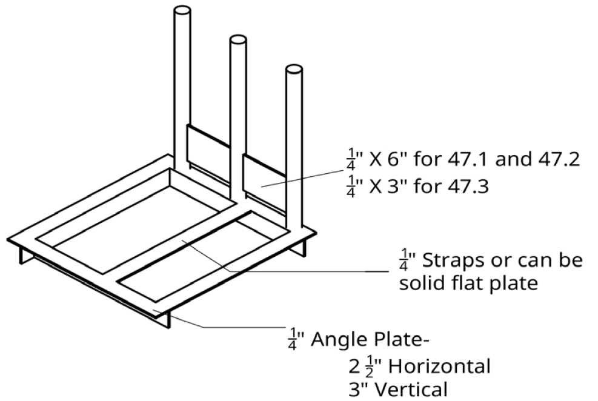
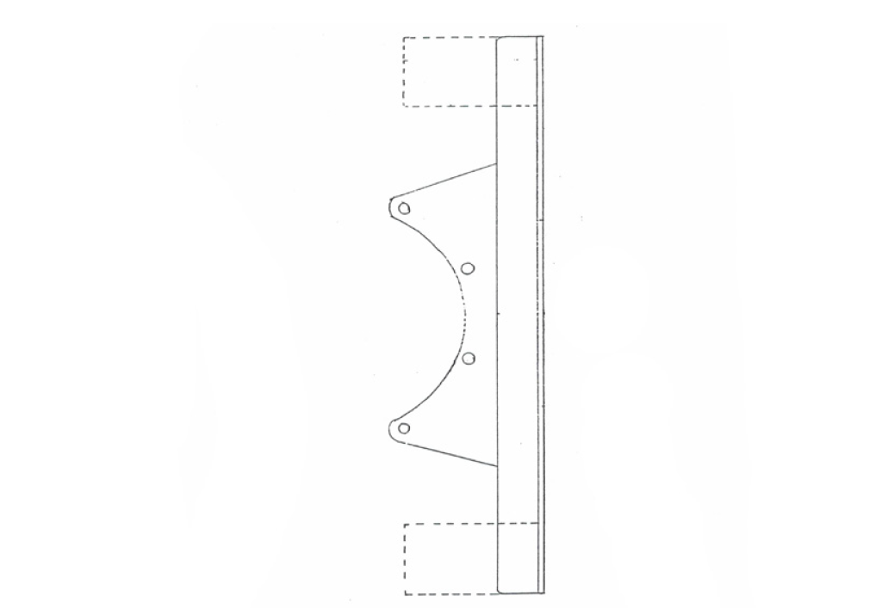
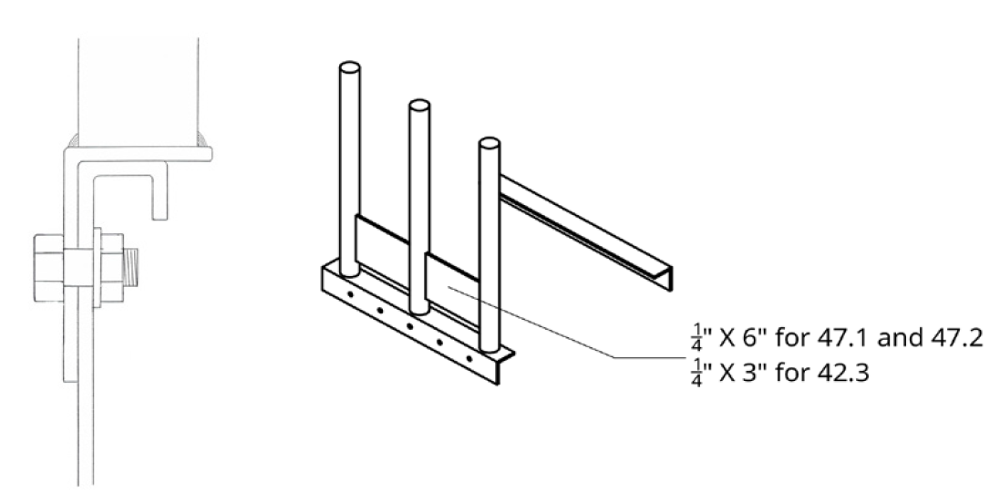
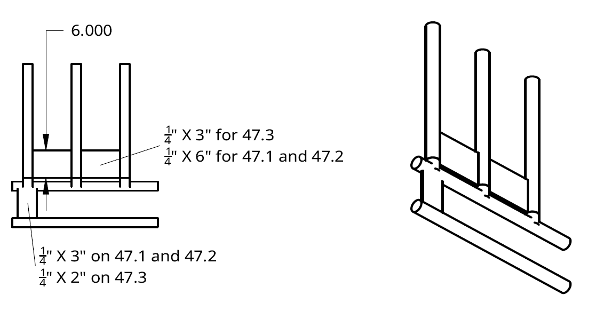

# Section 21 - TRACTOR GENERAL RULES
**Unless specifically outlined below in the Tractor General Rules the overall General rules outlined above will apply.**

## 21.1 - Tractor General Rules
1.  No four-wheel drive model tractor is eligible.

2.  No OEM cast component tractors allowed.

3.  If the OTTPA Board doubts the legality of any entry, or upon protest of another contestant in that class, the contestant in question must verify that 150 units of the tractor in question had been manufactured (notarized statement from the manufacturer). The contestant in question will furnish part numbers and prove to the board’s satisfaction that the tractor is a legal entry.

4.  Tractor airbag suspensions are allowed, but no on-board compressors or controls of any kind to change the suspension. Only one fill point is allowed for the suspension.

5.  All ether bottles (starting aides) must be placed outside of the engine compartment.

## 21.2 - Tractor General: Safety
1.  All alcohol fueled tractors should have halon fire systems with at least 3 nozzles under the hood.

2.  Tractors utilizing on board fire extinguishing systems inside the engine compartment should not have extinguishing components attached to the sheet metal.

3.  Tractors are required to have an SFI6.2, SFI 6.3 or SFI 6.4 approved bellhousing or a SFI 4.2 bellhousing blanket that meets the following minimum construction specification: You cannot have visible holes in clutch housing to clear bellhousing.

    1.  17 inches wide and long enough to wrap around the bellhousing with at least a six (6) inch overlap.

    2.  Secured with six (6) two (2) inch wide nylon web straps with a steel D-ring on one end and sewn the length of the blanket (except for the overlap area) and to be tied in a saddle cinch.

    3.  Four (4) two (2) inch nylon web retaining straps each at the front and back of the blanket.

    4.  Must be in good condition and be within 5-year certification. Tag must be legible.

4.  Tractors must have either:

<!-- -->

1.  Safety tie bars mounted to rear axle housing with at least four (4) axle housing bolts and extending forward of flywheel area and fastened to side of block or main frame with at least two (2) 5/8-inch bolts; OR

2.  A one (1) piece frame extending from front of tractor to rear axle housing mounting bolts.

> ***NOTE:*** Tie bars of frame must be of sufficient strength to support the weight of tractor with the bolts used to split the tractor removed. If in question, to be approved by the OTTPA Executive Board.

5.  Carbureted or injected Allison, Packard, Industrial or Marine engines using a centrifugal supercharger must be shielded.

    1.  Shield to start at the center line of supercharger housing and extend 5 inches rearward, notching allowed only to fit around accessory components.

    2.  Shield must extend 8 inches forward of center line of blower housing and notched only for accessory components (such as air boxes).

    3.  On front edge of the shield there must be a rolled lip extending inward 1 inch.

    4.  Shield must be 3/8-inch steel, bolted every 2 inches or closer, with 3/8-inch bolts (Grade \#5 or better) or larger.

    5.  Shield must start at bottom of blower housing, up the side, over top and down other side to bottom of blower housing. Holes or notches allowed only for accessory components. Shield must maintain its integrity.

    6.  Shielding must be the same on each side of the supercharger. SFI Spec. 4.1 blanket required.

    7.  Allison blowers must have a steel shield as in rule 5: a-f above, or a SFI Spec. 4.1 blanket. No cutting or grinding on Allison supercharger wheels.

    8.  On pulling vehicles the tubing on the pressure side of the turbocharger or supercharger to the intake must be under the hood or side shields, or bolted or strapped securely.

6.  Turbine engines must have steel shielding around the hot section:

    1.  1500hp and less must have a minimum of 3/8 inch steel shielding

    2.  Over 1500hp must have a minimum of ½ in steel shielding

7.  All turbine engine exhaust stacks must have a minimum of 3 restraints distributed equally around the stack. The restraints must be attached to the stack and to a solid mounting point such as the steel hot section shield or tractor frame rails. Restraints must contain the exhaust stack to the vehicle if the stack was to come loose from the engine.

    1.  

## 21.3 - Tractor General: Tires
1.  Maximum tire size allowed for competition: 24.5x32 with a maximum of 210 -inch circumference+ 1%, when inflated to 10 psi. on a 26-inch-wide rim. Tread width not to exceed 25 inches. No radial tires allowed.

2.  Maximum tire size allowed for competition: 30.5x32 with a maximum of 212-inch circumference + 1%, when inflated to 10 psi. on a 28-inch-wide rim. Tread width not to exceed 31 inches. No radial tires allowed.

## 21.4 - Tractor General: Roll cage
1.  

2.  1.  
    2.  
    3.  
    4.  

3.  1.  
    2.  

4.  1.  

5.  SFI Standards

    1.  All Modified, Modified Mini, and Tractor classes must utilize a SFI roll cage with a SFI 16.1 five-point harness properly installed.

    2.  Roll cage must be certified by OTTPA or NTPA and display the OTTPA or NTPA certification sticker before vehicle is allowed to compete.

    3.  SFI 47.1A – 7,000 to 10,000 lb. classes

    4.  SFI 47.2A – 6,300 lb. and less classes

    5.  SFI 47.3A – 2,050 lb. and less classes

> ***NOTE:*** SFI Roll Cage standards are available for purchase from SFI Foundation, 15708 Pomerado Rd, Suite N208, Poway, CA 92064. Phone: 858.451.8868

***NOTE:*** It is recommended that competitor or fabricator order necessary SFI standard before build is started.

6.  Certification / Renewal

    1.  OTTPA / NTPA roll cage certification is valid for five (5) years from date of inspection.

    2.  Roll cage inspection can only take place with roll cage properly mounted to chassis. Driver seat, SFI 16.1 five-point harness, and any attaching hardware meeting grade 8 or greater standard must be installed.

7.  OTTPA / NTPA Roll Cage to Chassis Mounting

    1.  OEM Type Chassis – SFI 47.1A, 47.2A

        1.  Attachment to any tractor utilizing a stock, OEM rear end housing

            1.  Minimum 1/4-inch steel plate formed to create a one-piece, 90-degree steel angle – angle iron is permissible

            2.  U-shaped structure made from 2.5-inch horizontal x 3-inch vertical steel angle

            3.  U-shaped structure must be tied together with two (2), 1/4-inch steel straps, one located at front and one in middle across top of rear end housing and welded in place to tie steel angle on each side together. Equivalent size round steel tubing is permitted.

            4.  Vertical tubes welded to minimum 2.5-inch wide horizontal steel angle or 2.5-inch wide section of solid 1/4-inch steel plate.

            5.  Option: a 1/4-inch solid steel plate is used across top of OEM rear axle housing with 1/4-inch steel plate welded continuous vertically at 90 degrees to bottom of steel plate to mount structure to axle housing.

            6.  Attaching steel plate must extend min. 3.000 inches vertically downward.

            7.  Minimum qty. of two (2) axle housing bolts, min.1/2-inch diameter, grade 8 or greater, used to attach steel plate to axle housing on each side.

            8.  Total bolt diameter to equal 2.5 inches min. – grade 8 or greater - on each side in horizontal position. Any bolt in a vertical position is not considered when calculating 2.5-inch total bolt diameter required.

            9.  At least one attachment bolt must be located within three (3) inches forward or rearward of front vertical tube.

            10. Back vertical tubes (back bone) must be attached by welding to 1/4-inch steel angle or plate and bolted to rear end housing with a min. of two (2) 1/2-inch grade 8 or greater bolts.  
                 

    2.  Channel Type Chassis – SFI 47.1A, 47.2A, 47.3A

        1.  Method One – direct welded to top of C channel type chassis if steel.

            1.  Vertical tubes direct welded to C channel type frame must be supported horizontally with steel under entire diameter of tube.

        2.  Method Two – vertical tubes welded to 1/4-inch steel plate formed as one-piece, 90-degree steel angle plate.

            1.  SFI 47.1A and 47.2A: Steel angle 2.5 inches horizontal x 3 inches vertical min.

            2.  SFI 47.3A: Steel angle 2 inches horizontal x 2 inches vertical min.

            3.  Angle iron permitted.

            4.  Vertical side of steel angle to be bolted to vertical side of channel frame.

        3.  Total Bolt Diameter min.– grade 8 or greater

            1.  SFI 47.1A and 47.2A = 2.5 inches each side –1/2-in. dia. min.- 4 bolts min.

            2.  2\. SFI 47.3A = 1.8 inches min. each side – 4 bolts min. - 3/8-in. dia. min.

        4.  Channel Frame Stiffening

            1.  C-type channel or square tubing equal in wall thickness of chassis material required to stiffen chassis

            2.  2\. Supports to be stitch welded directly below each roll cage vertical tube and extend from underside of top channel to top of bottom channel  
                

    3.  Tube Type Chassis – SFI 47.1A, 47.2A, 47.3A

        1.  Vertical roll cage tubes can be welded directly to upper horizontal frame tube.

            1.  Support directly below each vertical roll cage tube required.

                1.  1/4-inch steel plate or steel tubing equal to support top horizontal chassis tube.

                2.  Support installed vertically between upper and lower horizontal tubes of chassis.

                3.  Upper horizontal chassis tube is considered the tube which has the required 1/4-inch web plates welded above tube.

                4.  Lower horizontal chassis tube is considered next horizontal tube below upper tube.

                    1.  SFI 47.1A and 47.2A – min. 1/4-inch x 3-inch wide steel plate or equivalent tubing.

                    2.  SFI 47.3A – min. 1/4-inch x 2-inch wide steel plate or equivalent tubing required.

        2.  Option 2 - Refer to 2) Channel Type Chassis, Method Two to attach to upper horizontal frame tube using 1/4-inch steel as described.

        3.  Back Tube Support

            1.  Both back roll cage tubes (back bone) must be welded directly to chassis, rear end housing, or angled to rear vertical tube on each side and welded at top or bottom edge of 1/4-inch thick web plate across back of roll cage.

    4.  No holes can be drilled into rollcage structure for any purpose.  
        

8.  Driver Compartment

    1.  All divisions that are required to use an SFI-approved roll cage must have a SFI 16.1 five-point driver restraint harness and driver seat mounted to the roll cage structure, independent of the tractor chassis.

    2.  The five-point restraint must be a quick-release design and be securely fastened during competition. Failure to use the restraint system will be grounds for disqualification.

    3.  Any vehicle with a roll cage is required to have a quick release, removable or swing away steering wheel.

> **Note:** For ease of extraction of driver in event of injury.

4.  All controls in driver’s compartment i.e. fuel shutoff / air shutoff/ ignition / throttle / shifter must be accessible while driver is strapped in seat with five-point harness latched.

5.  Area between forward angle brace, front vertical tube, and floor plate on a SFI 47.1A or 47.2A roll cage must be shielded with minimum .060-inch thick steel or aluminum and solidly attached. Shield intended to prevent operators foot from being caught behind forward brace when entering or exiting the driver compartment.

## 21.5 - Tractor General: Engine
1.  The engine block must remain in the original location as located by the manufacturer.

2.  No billet blocks allowed. This rule does not apply to PS, LSS Ag, MOD Tractor, LLM Tractor or Mini Rod classes.

3.  All engines must be secured and held rigid to OEM chassis. Engine cannot move independent of the rear-end/transmission housing.

4.  Must use OEM engine block that matches that OEM chassis.

5.  After market blocks allowed with the following exceptions (NOT allowed in LLP class)

    1.  Material

        1.  Stock, recast, steel or aluminum with everything in stock location.

    2.  Specifications

        1.  Stock crank is able to swing in the block.

        2.  Stock head bolt locations must be retained.

        3.  Stock cam gears need to work in stock location.

        4.  Max. 1 inch over stock deck height for all classes, except SF class (SF class max height is 5/8” greater than stock) from center line of crank to top of block or deck plate.

6.  Allis Chambers may run Detroit Series 40 or IH DT 466

7.  No computers allowed that automatically control any mechanical operation of the competing engine, clutch or vehicle except for water injection.

## 21.6 - Tractor General: Turbochargers
1.  All vehicles running in classes that have a mandatory turbo must run the legal turbo for class (example in SF Harts 3.6 x 4.55 smooth bore only), the rule applies to all mandatory turbo classes.

2.  For the 540 Light Pro, and LLP classes the following will be used to check the legality of the turbos in use:

    1.  2-point plug with one inch opening and a 30-degree face will verify compliance. 

    2.  Plug must fit the bore and avoid contact with compressor blades. 

> ***NOTE:*** Measurement devices to make sure turbo is legal can be purchased by contacting the OTTPA Competition Director.

## 21.7 - Tractor General: Head Rule
1.  Any cast or manufactured cylinder head will be accepted. No billet or aluminum.

2.  Cylinder head must retain OEM (Length/Width/Height) for engine application.

    1.  Exception: 1.5 inches can be added to the front and back end of the head for tie-down purposes only.

3.  Valves must retain the OEM angle for engine application. 2 valve per cylinder maximum.

4.  Cylinder head must retain OEM bolt pattern. The stock exhaust manifold and intake manifold bolt patterns must be used to attach the exhaust manifold and intake. Manifold must bolt 90 degrees to head.

## 21.8 - Tractor General: Component Chassis Rules
1.  Must install an aftermarket frame with a SFI 6.2, SFI 6.3 or SFI 6.4 approved bellhousing to replace the original clutch housing.

2.  Must install an aftermarket transmission and rear end/final drive housing. (If larger than 11-inch clutch is used, refer to industrial marine clutch rules listed in the General Rules section.)

3.  No cast iron Ag-type transmission or rear end components allowed.

4.  Engine location on component Super Stock Tractors:

    1.  Centerline of the crankshaft may not be below the centerline of rear axle and must be parallel within two (2) degrees in relationship to the ground. Two (2) degrees equals 7/16 inch per foot. This equals approximately four (4) inches of fall from the center of the rear axle to the 114-inch wheelbase point. This is to be measured with tire, hitch, and weight in ready to pull orientation.

5.  All engines in component tractors to be mounted no farther forward than 60 inches from the centerline of the rear axle to the rear of the engine block.

6.  Crankshaft centerline to be between top and bottom rail of frame. Bottom of frame rail may be no more than six (6) inches below centerline of crankshaft from rear of engine block forward.

7.  For tractors utilizing a component chassis, the engine and sheet metal do not have to match manufacturers’ brands.

## 21.9 - Tractor General: Chassis / Shielding
1.  Must have fenders or shield between driver and rear tires.

2.  Tractors must have hood and grill in place as intended by manufacturer.

3.  Sheet metal can be upgraded to present manufacturer upon approval from the OTTPA Board.

4.  Sheet metal upgrade cannot cross original manufacturer’s line. For example, Case IH to IH or Oliver to Minneapolis Moline is acceptable. IH to John Deere is not acceptable.

5.  Sheet metal to be stock length and in stock location.

6.  Tractors must retain stock appearance.  
    ***NOTE:*** The criteria used by the OTTPA Executive board will be the retention of stock appearance. The chassis and frame must remain stock from the rear of the engine block to the rear of the tractor.

7.  The distance from the center of the rear axle to the part of the hood that is farthest forward must be the same length of that model of the upgraded sheet metal.

8.  The maximum length of the tractor is 13 feet from center of rear wheel to forward most portions.

9.  Maximum of a 114 inch wheelbase unless originally produced with longer wheelbase, in which case stock length must remain.

10. Rear axles must remain in OEM position.

11. No John Deere 6000 or 7000 ag chassis allowed.

12. Aftermarket Bellhousing must be –SFI 6.2, SFI 6.3 or SFI 6.4 approved with a certified SFI sticker that is not expired. Can not have cracks or have had an explosion inside. Must have a liner.

13. A split frame chassis must have at least one of the following that has been reviewed and approved by a Tech Official:

    1.  A mending plate support across the split. Mending plates to be 4" long, 1/4" thick steel plate on each side with 2" overlap with two (2) 1/2" bolts securing them.

    2.  A slug installed inside the frame rail tubes across the split in the frame

    3.  Any other supports or braces will need to be approved by the OTTPA Head Tech.

## 21.10 – Tractor General: Gearbox / Crossbox Construction and Shielding
1.  All Lenco-type planetary transmissions, including reverser must be covered with a SFI 4.1 Spec Blanket.

2.  Cross Gearbox Construction

    1.  All cross gearboxes and/or multi-engine gear boxes are required to be minimum 1-inch billet aluminum or 1/2-inch steel thickness around circumference of rotating gears.

    2.  Any gear box less than minimum specified thickness may add a steel strap radially 360 degrees and fastened within 1/8-inch of gear box to achieve minimum total thickness of gear box.

    3.  Turbine Powered Applications

        1.  No laminated cross gearboxes are accepted in any multi-turbine engine application.

        2.  Only billet aluminum or steel gear boxes manufactured greater than the minimum thickness standard are accepted.

        3.  All gears must be solid steel gears, no holes machined or manufactured into the gear other than center shaft opening.

        4.  Safety blanket is required in all cross gearbox applications and must be manufactured to greater than minimum standards listed in sub-section c.

    4.  Cross Gearbox Blanket

        1.  A blanket must wrap 360 degrees around the circumference of the cross gearbox or multi-engine gear box.

        2.  The blanket must be 20 layers of Ballistic nylon or 15 layers of Kevlar with straps that wrap around the entire gearbox at least every ten inches.

        3.  Blanket to be a minimum width of at least three times the width of the gearbox.

> ***NOTE:*** The blanket does not apply to a single engine stack box.

## 21.11 - Tractor General: Transmission / Clutch / Rear End
1.  Only mechanically activated clutches are permitted.

2.  Neutral safety switches are to be in or on the transmission.

3.  The stock transmission housing or manufacturer’s replacement must be used.

4.  The stock final drive housings or manufactures replacements must be used.

5.  The clutch housing, transmission case, rear end housing and axle housing must be OEM with no aluminum replacements.

6.  Any cast chassis must have all OEM bolts in place.

7.  Hole may be cut for mounting aftermarket transmission, reverser or drop box.

8.  Maximum 1/2 spacer allowed between engine block and transmission.

9.  Tractors with planetaries are considered part of the final drive and are not removable.

## 21.12 – Modified and Component Tractor Driveline
1.  No drive shaft over 48 inches long allowed.

## 21.13 - Tractor General: Cast Tub Frame
1.  Allow tractors with cast tub (belly) type frame (i.e. Oliver, Cockshutt, White) to remove the complete frame from front of transmission housing. Engine and clutch housing to remain in original location and mounted solid as intended by manufacturer.

## 21.14 - Tractor General: Fuel & Water
1.  VP Racing Fuel is the only fuel that is allowed for use in all pulling vehicles. VP DX fuel is allowed.

2.  VGM water is the only water injected water that is allowed. All water injected vehicles must run VGM water only.

3.  A \$50 fine will be assessed for lack of fuel and water test ports for all classes.

4.  A \$50 fine will be assessed for any minor infractions of fuel or water quality.

## 21.15 - Tractor General: Drawbar / Hitch
1.  Minimum drawbar length is 18 inches from the center of the rear axle to the hooking point on the drawbar.

2.  Maximum height is 20 inches.

3.  Drawbar must be rigid in all directions.

4.  Drawbar maximum of 10 degrees from level.

5.  Pulling point must be within one (1) and 1 1/2 inches from back edge of hitch and no less than 3/4 inches.
