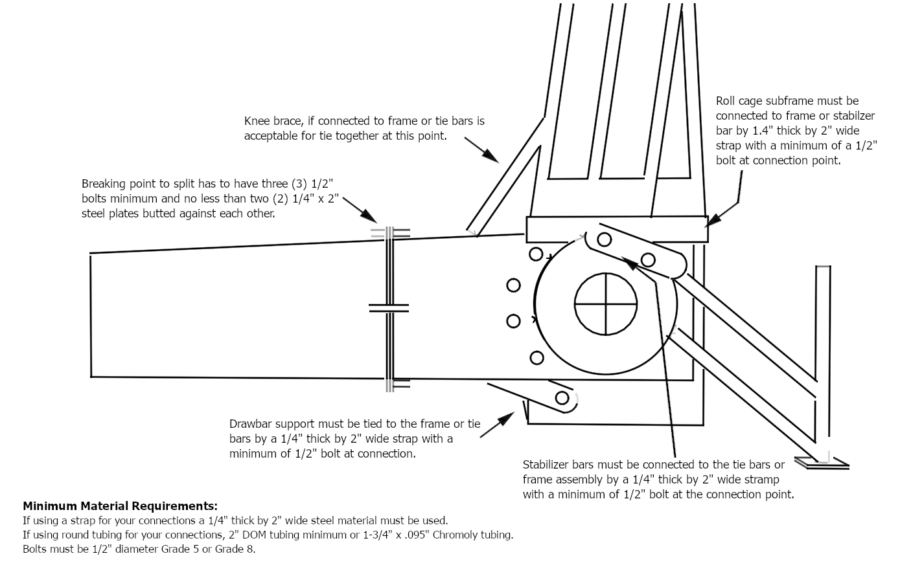

# Section 31 - LIGHT SUPER STOCK TRACTORS – AG (LSSAG)
**Unless specifically outlined below in the class specific rules, the Tractor General Rules and the overall General rules outlined above will apply.**

## 31.1 - General Rules
1.  No component tractors in the Light Super Stock (AG) class.

2.  Appearance to remain stock of given brand and model.

3.  May run SFI 47.2 two bar roll cage.

4.  Light Super Stock Tractors will compete at the following weights:

    1.  Diesel tractors will compete at a maximum of 6300 lbs.

    2.  Alcohol tractors will compete at a maximum of 6000 lbs.

## 31.2 - Chassis
1.  All Light Super Stock tractors must have OEM cast engine, clutch/transmission housing, and rear end housing, axle housings bolted together with no unnecessary holes cut or drilled. No aluminum replacements.

2.  All clutch, transmission, or rear end housings must be stock height and length and width.

3.  John Deere tractors that run 4010 transmission/rear end housings can run a 1" spacer plate to match length of a 4020 transmission/rearend housing.

4.  No tractor can run outboard planetaries on tractors that were not offered from the factory with outboard planetaries.

5.  No sub-frames of different materials allowed in replacement of cast.

6.  No additional holes in bellhousing allowed.

7.  If cast is broke, it must be replaced with no holes in new housing.

8.  No John Deere 6000 or 7000 series chassis allowed, may run 6000 series sheet metal.

9.  Allis Chalmers D21 rear end housing can cut off 1 ½ inches off of the top.

10. All tube ladder-type frames must be covered on outside with steel or aluminum 0.060 thick and run in the same plain as the crankshaft.

11. Light super stock class all tractors must have one-piece frames that attaches the roll cage, wheelie bars, hitch and frame together see diagram.  
    

## 31.3 - Tires
1.  Any 30.5 x 32-inch tires are allowed.

## 31.4 - Engine
1.  Only engine considered legal to be used in super stock division must be available in two-wheel drive farm tractors.

2.  OEM V8 motors allowed. White/Cat, Massey/Perkins, IH/DT550

3.  Maximum distance of one (1) inch deck plate between the bottom of the cylinder head and top of the engine block. A maximum allowance of .130 total gaskets with a maximum of 504 cubic inch total.

4.  External hold-down devices recommended for holding head to block. This device connects to the top of the head and bottom of block and must remain behind side shields. This device does not replace the safety cable, which must remain in place.

5.  Any alterations to the chassis shell must have the written approval of the OTTPA Board before the tractor in question will be considered a legal entry.

6.  The engine block cannot be modified externally from OEM configuration, except for normal repair or for mounting of fuel injection pumps.

7.  Recast aluminum and billet blocks are allowed as long as they are OEM size and spec.

8.  Sigma fuel injection pump is allowed.

9.  No magneto ignition systems allowed.

10. Allowed to run any coil type ignition that is not computer controlled.

11. Allis Chalmers may run Detroit Series 40 or IH DT 466

12. Only 360 cubic inch or less engines running a twin turbo or single turbo set up may run intercoolers. Water and/or ice allowed.

13. Tractor inner side shields. All inline engines are required to have an additional side shield consisting of .125 (1/8 inch) steel or titanium or .250 (1/4 inch) thick aluminum inside of the current .060-inch steel or aluminum side shields with a minimum of ½ inch air gap. The shield is independent of the current side shield and must be attached to the chassis (frame) with a minimum of 5/16 fastener at both ends and the center on the bottom or suspended a minimum of 3 inches below the top of the frame rail and to the engine block at both ends bolted solid to the bolt if suspended or with a length of 5/16 chain if fastened at bottom at deck height on the top. This shield must extend from the bottom of the head to the centerline of the crankshaft and extend the full length of the block on each side of the engine

## 31.5 - Turbocharger
1.  Alcohol 510 to 640 cubic inch motors are limited to one (1) 4.1 max. turbocharger.

2.  Diesel 510 to 640 cubic inch motors are limited to one (1) max. 5 x 5.25 inch turbocharger.

3.  505 cubic inch engines and lower may run up to 4 turbos 3 stage max, diesel or alcohol

## 31.6 - Fuel & Water
1.  VP Racing Fuel is the only fuel that is allowed for use in all pulling vehicles. VP TORQ DX fuel is allowed.

2.  VGM water is the only water injected water that is allowed.

3.  A \$50 fine will be assessed for lack of fuel and water test ports for all classes.

4.  A \$50 fine will be assessed for any minor infractions of fuel or water quality.

5.  No alcohol, alcohol-based substances, other additives and/or formulas containing alcohol of any kind or manner may be used or allowed in water injection.

6.  No alcohol is to be injected before the throttle body.

## 31.7 - LSS (AG) Acceptable Rear-End / Engine Combinations
| **Make**              | **Rear-End**                             | **Engine**             |
|-----------------------|------------------------------------------|------------------------|
| **John Deere**        | 3010, 2840, 4040, 4050\*                 | 329, 359, 414          |
| **John Deere**        | 4010, 4020, 4040, 4050, 4055             | 404, 466               |
| **International**     | 460, 560, 656, 666, 706\*                | 274, 360               |
| **International**     | 706, 806, 966, 1066, 1466                | 414, 436, 466          |
| **Case**              | 730, 830\*                               | 267 (4 cyl)            |
| **Case**              | 830, 930, 1030, 1070                     | 401, 451, 504          |
| **Allis**             | 180, 190, 7000\*                         | 301, 5.9 Cummins       |
| **Allis**             | D21, 220                                 | 426, 466 Detroit       |
| **Ford**              | 3000, 4000, 5000\*, 7000\*               | 4 cyl.                 |
| **Ford**              | 5000, 7000, 8000, 7910, 8210             | 401, 458, 478          |
| **Cockshut**          | 440, 550                                 | 4 cyl, 340             |
| **Oliver, White**     | 1650, 1750, 1800\*, 1850\*, 1950\*       | 283, 310 Waukesha      |
| ** **                 | 2-105, 2-110, 2-280                      | 354 Perkins            |
| ** **                 | W-100, W-120, W-140 (Spirit of Cockshut) | 359 Cummins            |
| **Oliver, White, MM** | 160, 170, 185, 195, 135, 155, 1800,      | 478 Hercules           |
| ** **                 | 1850, 1950, 2050, 2150, 2255,            | 504 Cummins            |
| ** **                 | 1355, 2-150, G-1000                      | 585 Minneapolis Moline |
|                       | **1855**                                 | **3208 Caterpiller**   |
