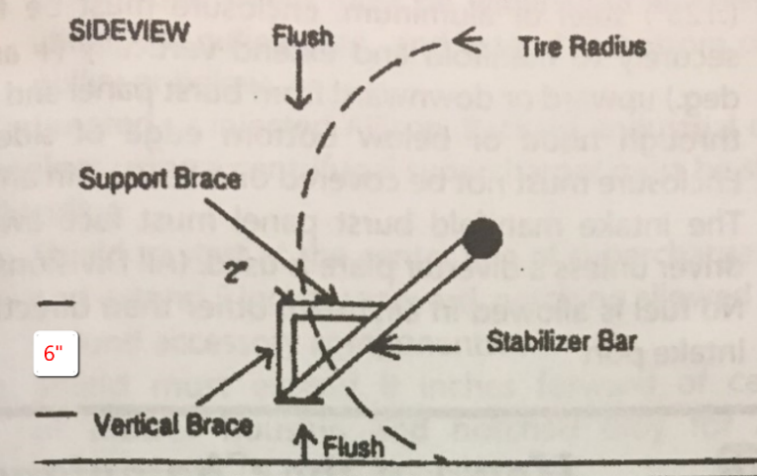
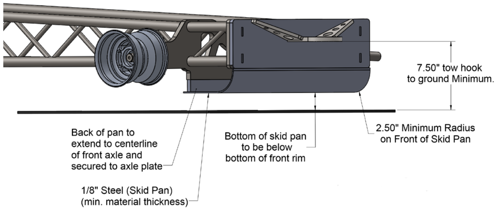

# Section 35 - SUPER MODIFIED MINI-ROD TRACTORS (SMRT)
**Unless specifically outlined below in the class specific rules, the Tractor General Rules and the overall General rules outlined above will apply.**

## 35.1 - General Rules
1.  Super Modified Mini-Rod Tractors will compete at a maximum weight of 2,050 lbs.

2.  Both driver’s feet must rest inside the main frame rails and even with or behind rear of bellhousing while seated inside roll cage with 5pt. restraint harness fastened.

3.  Brake pedals must be mounted directly ahead of foot rest and inside the main frame rails.

4.  Feet and brake pedals must remain inside the main frame rails and behind the engine block plate during brake pedal application

## 35.2 - Chassis
1.  No portion of tractor shall exceed 8 feet forward of the center of the rear wheel.

2.  Tread width (footprint) not to exceed 6 feet in width.

## 35.3 - Tires
1.  Maximum tire size is 18.4 x 16.1

    1.  Maximum of 143-inch circumference when mounted on an 18-inch-wide rim and inflated to 10 psi.

2.  The ground patch is not to exceed 19 inches on original tread.

3.  No tire repairs (boots, section repair, vulcanized spots, etc.)

## 35.4 - Engine
1.  Limited to a maximum of 575 cu. in. supercharged engine

    1.  10-71 and larger superchargers limited to maximum 45% overdrive.

    2.  14-71 supercharger is the maximum allowed.

    3.  8-71 and smaller superchargers limited to maximum 65% overdrive.

2.  650 cu. in. naturally aspirated

3.  One (1) gas turbine with an 1800 hp limit based on the allowed OTTPA turbine engines and stated horsepower ratings.

4.  Turbochargers allowed only single staged.

    1.  Must follow the General Turbocharger safety rules that apply to all turbocharged engines.

5.  All engines are limited to (2) valves per cylinder.

    1.  Exception: Vehicle allowed to run four-valve cylinder heads if using a small block Chevrolet engine with a maximum of 400 cu. in.

6.  Engines may run more than (1) spark plug per cylinder.

7.  All Modified Mini tractor engine/automatic transmission combinations must have:

    1.  Two front engine mounts, 2 rear engine mounts, and a support saddle for rear of transmission, with ½ inch maximum clearance; or

    2.  Two front engine mounts, support saddle at rear of engine, with ½ inch clearance, and a mount at rear of transmission.

***NOTE:*** This is to prevent engine or transmission from dropping if breakage occurs.

> ***NOTE***: Only 4 bolts for bellhousing to transmission/gearbox mounting are required as opposed to 5 for mini rod use.

## 35.5 - Driveline & Shielding
1.  Mini Rod tractors must meet general tractor shielding, safety criteria and driveline shielding, with the following addition for vehicles with 8-71 or larger supercharger and/or planetary rear end.

    1.  All mini rods must shield the transmission with a minimum of 0.125 steel or titanium. Shield must cover the full width of the transmission (minus the reverser) top and both sides, while open at the bottom in a “U” shaped over the transmission. Shield not to exceed one-inch air gap between shield and transmission. Shield must be attached at the top forward to the engine plate or engine and at the bottom to each side of the chassis. OR be allowed an SFI 4.1 transmission blanket attached in the same fashion.

    2.  All mini rods must have a driveline tether to be center of driveline length. Tether must be constructed of a minimum of 2” wide 3/32” thick nylon strap. Tether must attach to one side of the frame then to the driveline shield then on to the other side of the frame by a minimum of one 3/8” grade five bolt at all three points of attachment. Strap must have metal grommet for each bolt to pass through.

## 35.6 - Drawbar / Hitch
1.  Drawbar and hitching device to be one-piece construction, with a minimum of 1-inch solid steel material.

2.  No hollow tubing is permitted.

3.  Front part of drawbar is to have a minimum of ½ inch cross sectional thickness to remain on the front side of hole where drilled.

4.  Minimum 5/8-inch grade 8 pin.

5.  Drawbar height adjuster or hold up / down device to be no more than 5 inches from hook point. There must be a minimum of ½ metal remaining where the hole is drilled. Hose clamps may not be used for any drawbar related devices.

6.  The drawbar receiver or the material where the front of the drawbar is attached must have a minimum of ¼ inch thick metal on each side of a horizontal pin drawbar.

7.  Point of Hook.

    1.  The point of hook is to have a minimum of a 2-inch round hole, maximum 2 ¼ inch hole.

    2.  The thickness of material around the hole must be a minimum ¾ inch thick.

    3.  Point of hook to be no more than ¾ inch cross sectional thickness.

## 35.7 - Stabilizer Bars
1.  Stabilizer bars are required.

2.  This device is to have a skid plate.

3.  Skid pads to be at least 4 inches square at ground contact point.

4.  Skid pads to be a minimum of one-half the tire diameter when measured horizontally from rear axle centerline to rear of pad.

5.  Pad to be a maximum of 6 inches above the ground.

6.  There must be one skid pad or wheel on each side of the tractor.

7.  The combination must be strong enough to support the weight of the tractor.

8.  In addition to the stabilizer bars, there must be a brace that extends vertically 6 inches from the rear most tip of the skid pads.

9.  There must be a support brace extending inward to frame, axle, or top of stabilizer bar arms.

10. Vertical brace should extend rearward a minimum of 2 inches from radius of rear tire.

11. Material used to build vertical brace and support brace must be the same size and strength as the material used to build stabilizer bar.

## 35.8 – Front Skid Plate
2.  Skid Plate required on all vehicles at all levels in this division. Front skid plate to be configured according to diagram and dimensions as follows:

    1.  Skid plate must be made from .125-inch steel and extend across under front of chassis - rail to rail and solidly attached

    2.  Skid plate formed at 90 degrees with a minimum 2.500-inch radius at bottom front of skid

    3.  Tow hitch placed minimum 7.500 inches from ground

    4.  Skid plate to extend rearward under chassis to center of front axle

    5.  Bottom of skid plate to be at or bellow bottom of front rim.

